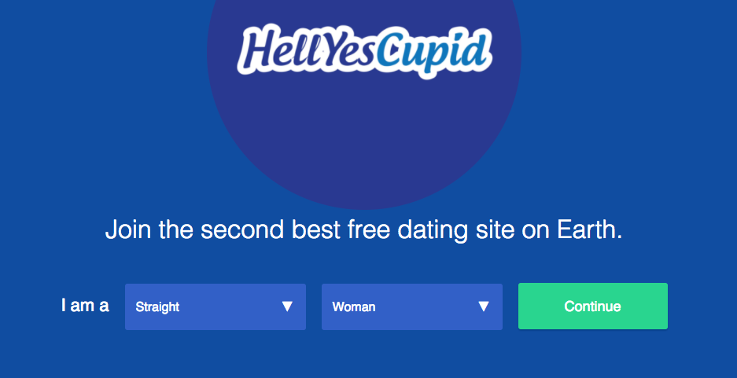

#HellYesCupid

[Demo HellYesCupid][hellyescupid]
[hellyescupid]: http://hellyescupid.com



##Abstract
At least for this developer, the original OkCupid always produced the best dates, its wealth of information on matches and revered matching algorithm being indispensable to the bachelor needing to distinguish between what might be a good date, and what might turn out to be so bad it wouldn’t even be worth the story.

It was in this spirit that the developer set out to clone one of his very favorite apps. The final product is HellYesCupid, a dating web app that allows lovers to view and filter matches, answer match questions, and message potential future spouses or spurned ex-es. 

##Architecture

###Backend
The backend of HellYesCupid was handcrafted using Ruby on Rails, with heavy assistance from Jbuilder in views. The database was made possible by PostgreSQL.

###Frontend
The frontend of HellYesCupid is but a single page, constructed using the beloved React.js library and Redux framework.

##Matches
In the “Browse Matches” section of the app, HellYesCupid serves the user matches based on their sexual preference and gender orientation. Users can then further filter by age or by distance.

```ruby
@matches = User.where(:age => (min_age)..(max_age)).where.not(:id => current_user.id).where(:gender => current_user.preference).within(distance, :origin => current_user)
```

##Questions
In order to determine their fit with a potential match, users can answer personality questions. These work as follows:

1. Users choose one answer to the question
2. Users choose among which answers they find acceptable (e.g. how many times a day do you brush your teeth?)
3. Users weigh the question based on how much bearing the question has on their everyday lives. The weightings are:

* 1 for not important
* 10 for a little important
* 50 for somewhat important
* 100 for very important

##The Matching Algorithm
When two people have answered identical questions, the matching algorithm kicks in. It works like this:

1. We first add up all of the points given to my questions, where the points are simply the weights outlined above.
2. We determine if your answer was in my list of acceptable answers. If so, you get those points for the question (1, 10, 50 or 100).
3. The number of points you scored out of my total possible number of points is your match percentage with me.
4. We repeat the process, expect now our roles are reversed (we check your acceptable answers against my answers).
5. With the two match percentages in hand, we multiply them then take the nth root of the result, where n is the number of questions examined. If, at this point, you’re saying to yourself, “well that’s just a geometric mean!” you’d be spot on.

```javascript
const match_percentage = Math.pow(product, 1 / numQuestions) * 100;
return Math.round(match_percentage);
```

And that’s how the matching algorithm works. 

##Profiles
Each user has their very own profile, where they can answer or not answer questions common to all profiles. They can also upload and re-upload a single profile picture.

##Messages
Yes, you can even send messages on HellYesCupid. Messages are created by hitting the “Message” button on another user’s profile, at which point a thread is created and the two lovers can chat for as long as their hearts desire.

##Libraries to Thank
The following libraries contributed heavily to the devlopment of HellYesCupid, and are hearby thanked for their services:

- [React.js](https://facebook.github.io/react/)
- [Redux](http://redux.js.org/)
- [BCrypt](https://github.com/codahale/bcrypt-ruby) for password hashing
- [Paperclip](https://github.com/thoughtbot/paperclip) for image uploading
- [Figaro](https://github.com/laserlemon/figaro) for storing AWS keys
- [Rheostat] (https://github.com/airbnb/rheostat) for that excellent slider to filter by distance
- [Geokit-Rails] (https://github.com/geokit/geokit-rails) to filter by distance 
- [Jbuilder v. 2.5]. (https://github.com/rails/jbuilder) Really can’t say enough about this one.


##Future Development
These are some features that HellYesCupid would could definitely stand to benefit from going forward:

* More options for sexuality and gender.
	* This was sadly beyond the scope of the MVP, but is first on the list for post-MVP development. 

* Uploading of multiple photos. 
	* Given that you would never really date someone based on a single photo, this seems fairly essential moving forward.

* Live chat
	* For obvious reasons

* Likes
	* Similarly obvious


